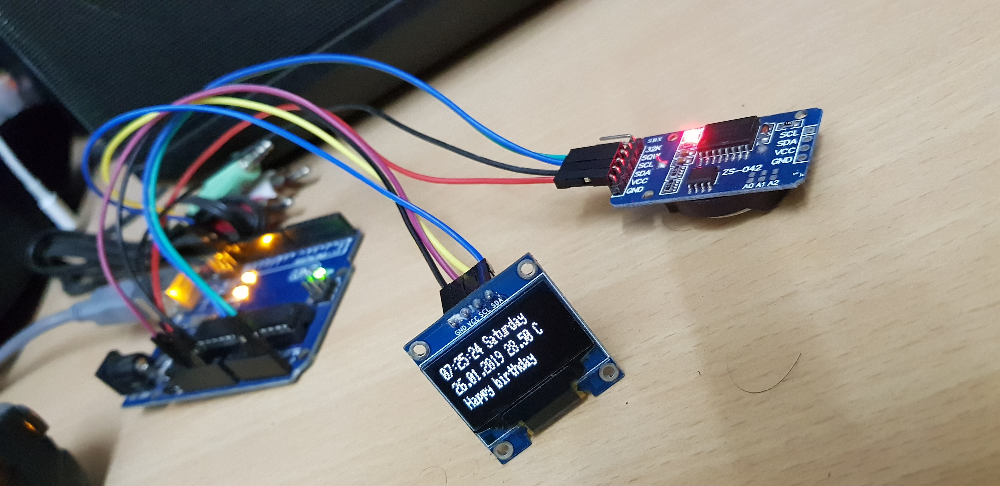
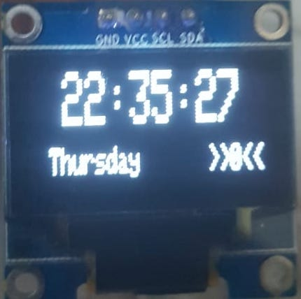

# digital clock with birthday alarm
The digital clock with birthday alarm is a DYI alarm built using Arduino UNO, Adafruit OLED and DS 3231 RTC module. You can use this to remember your birthday or you can gift this project to your loved ones.

# Latest Feature

1. Total 3 screens to display different content
2. 1st screen for time and day
3. 2nd screen for date and temperature
4. 3rd screen for notification
5. Each screen timer set for 3 seconds

# Features

1. Display Time
2. Display Day
3. Display Date
4. Temperature
5. Display "happy birthday" on the given birthday date

# Requirements

1. Arduino UNO (For programming)
2. DS3231 RTC module
3. Adafruit OLED display
4. Jumper pins or wires
5. Dotted PCB

# Instructions

First we will setup the date and time to the RTC module.

1. Download the RTC module library from [this link](http://www.rinkydinkelectronics.com/download.php?f=DS3231.zip).
2. Add the library to the Arduino IDE.
3. Connect the coin cell to the RTC module.
4. Connect SDA to UNO's A4, SCL to UNO's A5, VCC to UNO's 5v and GND to UNO's GND.
5. Open the code present at program-code/code-to-set-date-time/code-to-set-date-time.ino.
6. Edit according to the comments present in the code.
7. Run it to set the date and time.

Note: Run the program only once. This code sets the date and time to the RTC module. 

Now, we will install Adafruit OLED library and run the clock code.

1. Install Adafruit GFX library and Adafruit SSD1306 library from manage libraries.
2. Edit the code present at program-code/clock-code/clock-code.ino to set the birthday date.
3. Run the above code to start the clock.